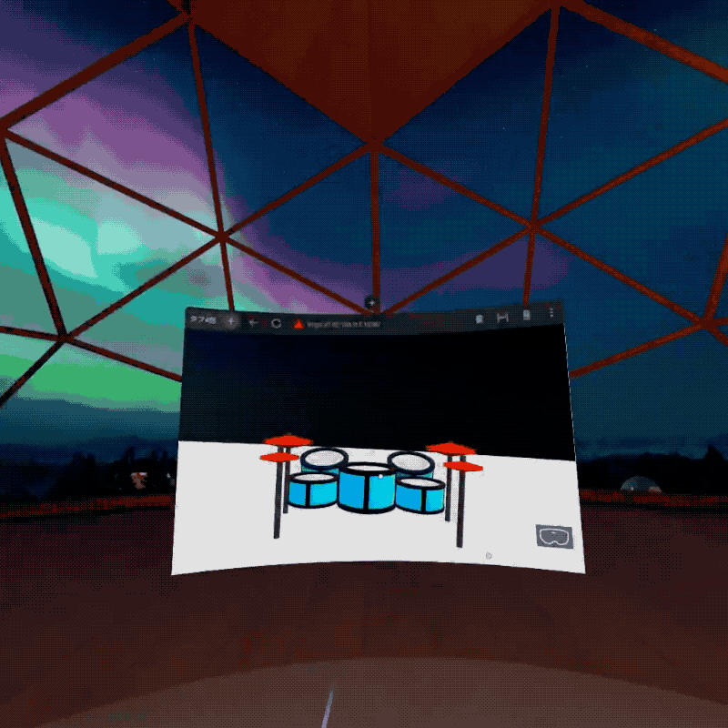
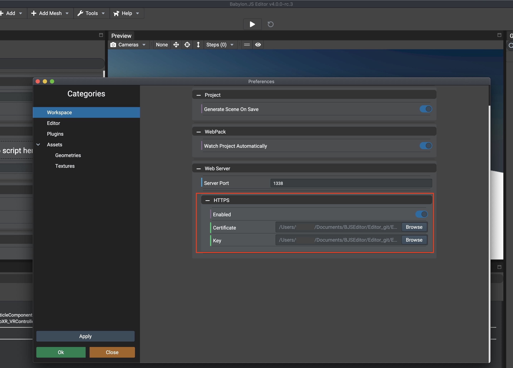
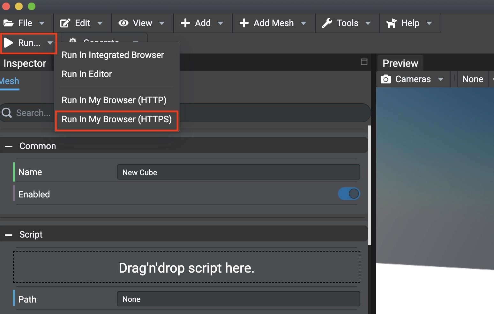

# WebXR_VRController_Editor_template



# Background

There is a few combinated information about Babylon.js Editor and WebXR.

The repository is an example of WebXR (immersive-vr) project working on Babylon.js Editor.   

Environment :  Babylon.js Editor v4.0.0 rc-3 or later

# Environment

1. Get Babylon.js Editor source  

```bash
$ git clone https://github.com/BabylonJS/Editor.git
```

2. Switch release branch and build

```bash
$ git checkout -b release/4.0.0 origin/release/4.0.0
$ npm install
$ npm run build
```

3. Run Babylon.js Editor.exe ( or Babylon.js Editor.app if you use Mac)  

```
electron-packages / windows /Babylon.js Editor.exe 
```

```
electron-packages / mac /Babylon.js Editor.app
```

# Run the sample project

1. Download the repo on any floder

2. Run Babylon.js Editor and select "workspace.editorworkspace" file  
Then dramset view is opened.  


3. Edit > Preference, select Workspace, and enable https 


4. Generate certificate and private key files and set them.  

e.g. how to generate files.

```bash
$ openssl req -newkey rsa:2048 -new -nodes -x509 -days 3650 -keyout key.pem -out cert.pem
```

Ref:https://github.com/http-party/http-server#tlsssl


5. Right click "Run" and  press "Run in My browser (HTTPS)"



6. Your default web browser shows a new page as "http://<IP address>:1338".  
Access the URL on Oculus Quest2 or other WebXR compatible devices.  

7. A dramset is showed in a virtual space. When you press keys of controllers, particle effects appears from each cymbals. Drams expand.  

